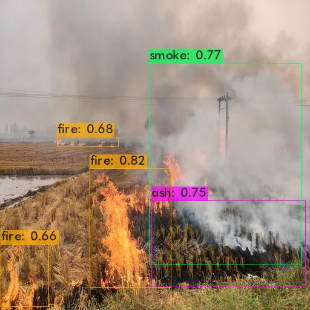
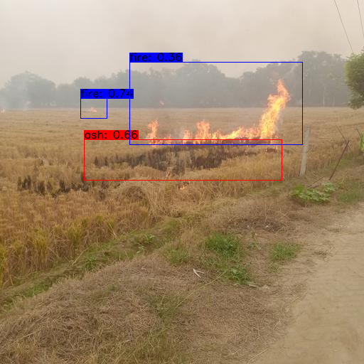
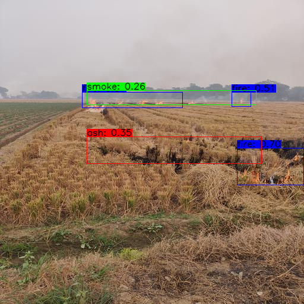

# test-on-edge-device

### code copied from repo tensorflow-yolov4-tflite by hunglc007

<b> link to the original <a href="https://github.com/hunglc007/tensorflow-yolov4-tflite">repo</a> </b>

<hr>

The `/checkpoints` folder has two `.tflite` models(fp-32 and fp-16 quantized) for object detection, trained on classes <b>ash</b>, <b>fire</b> and <b>smoke</b> on Yolov4-tiny and then converted to Tensorflow-Lite equivalent for deployment on edge devices. Also /data/classes/coco.names was updated accordingly with model needs.

### Demo

```bash
# Run demo tflite model (image)
python detect.py --weights  ./checkpoints/yolov4-416-fp16.tflite --size 416 --model yolov4 --image ./data/AFL/img10.jpg --framework tflite

# returns the prediction result image (result.png) in same directory 


# Run demo tflite model (video)
 python detectvideo.py --weights  ./checkpoints/yolov4-416-fp16.tflite --size 416 --model yolov4 --video ./data/AFL/video1.mp4 --framework tflite

#returns a folder named `video_output` with individual frames marked with predictions performed by the model. 
```


<br>

### Output

##### Yolov4-tiny original weight
<p align="center"></p>

<br>

##### Yolov4-tiny to tflite-fp32 converted model 
<p align="center"></p>

<br>

##### Yolov4-tiny to tflite-fp16 converted model
<p align="center"></p>

<hr>

### Performance Comparison

|   fp     | AMD Ryzen 5 5500U | Snapdragon 439 | RPI 4 ModelB |
| -------- | ----------------- | -------------- | ------------ |
|   fp16   |    160 - 175 ms   |  820 - 835 ms  | 780 - 800 ms |  
|   fp32   |    165 - 175 ms   |  830 - 840 ms  | 790 - 800 ms |


above results are for inference on a single image.


<hr>

### Install Requirements:

> pip install -r requirements.txt

<hr>